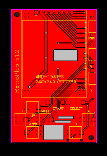
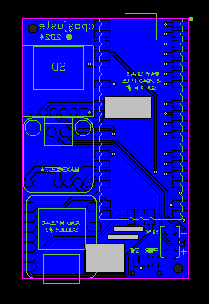

<h1 align="center">RetroPico</h1>

  

RertroPico is "yet another" rp2040 handeld device.

The whole project was done by myself, and I'm very proud of it. This includes familiarizing with microcontrollers, writing a cross platform framework for linux and the chosen one (rp2040), porting some emulators, designing a pcb and finally buying, designing and printing a 3d case for it.

The main goal was to make a cheap handheld capable of running a few 8 bit consoles on a homemade tiny device, which can be "easily" (with a few soldering skills) done at a reasonable price. Finally, it would be totally open source, of course. The cost of the device is currently ~40€ for the components (and shipping). Building instructions and documentation is in the work.

The "retropico" os currently support four 8 bits consoles inducing the nes, gameboy, master system and game gear. While a lot of work has been put into porting the emulated systems (including 60fps, sram support, ...), the emulation is far from perfect. A few games won't run, more will have graphical glitches, but the fun is here.

### PCB

TOP | BOT
:--:|:--:
 | 

### Components
- 6 x 6x6x5mm "Mute Switch Silicone Keypad Push Button Switch 2Pins Silent Switches" ([pic](docs/pics/components/2p-tactile-switch-6x6x5mm.jpg), [link](https://aliexpress.com/item/4000678658427.html))
- 1 x 9x3.5x3.5mm "3 Feet 2 Gears, Handle Length 2MM Side Patch Slide Switch" ([pic](docs/pics/components/toggle-switch-9x3.5x3.5mm.jpg), [link](https://aliexpress.com/item/1005001393065450.html))
- 5 x 3x6x4.3mm "SMD Tactile Tact Push Button Switch 2Pin" ([pic](docs/pics/components/tactile-push-button-3x6x4.3mm.jpg), [link](https://aliexpress.com/item/1005006195658674.html))
- 1 x 1.25mm "JST Connector Horizontal SMD Socket 1.25 Pitch Pin Header 2P" ([pic](docs/pics/components/jst-1.25mm.jpg), [link](https://aliexpress.com/item/4000691147583.html))
- 1 x "TFT IPS LCD Display Module 1.54 inch 240x240 SPI ST7789" ([pic](docs/pics/components/1.54-tft-ips.jpg), [link](https://aliexpress.com/item/1005004688575288.html))
- 1 x "Micro SD Card Mini TF Card Reader Module SPI interfaces with level converter chip 5V/3.3V" ([pic](docs/pics/components/sd-module.jpg), [link](https://aliexpress.com/item/1865616455.html))
- 1 x "High Quality MAX98357 MAX98357A I2S 3W Class D Amplifier Breakout Interface I2S DAC Decoder for Audio" ([pic](docs/pics/components/max98357a.jpg), [link](https://aliexpress.com/item/33043664469.html))
- 1 x "Waveshare RP2040-Plus 16MB" ([pic](docs/pics/components/waveshare-rp2040-plus.jpg), [link](https://aliexpress.com/item/1005007298252311.html))
- 1 x "Ultra Thin Mini Speaker 8 ohm 2 Watt 2W 8R Speaker Diameter 20MM" ([pic](docs/pics/components/hp-2w8r-20mm.jpg), [link](https://aliexpress.com/item/1005005376301547.html))
- 1 x "EEMB Batterie 3.7V 820mAh 653042 Batterie Lipo 3.7V" (or similar size: 44x30.5x6.8mm) ([pic](docs/pics/components/820mah-lipo.jpg), [link](https://www.amazon.com/dp/B08HJ53Q3C))
- 1 x RetroPico PCB ([pic](docs/pics/components/retropico-pcb-v1.1.jpg), [TODO](TODO))
- 1 x RetroPico Case (TODO)

I use [JetBrains CLion](https://www.jetbrains.com/clion/) IDE for all my open sources projects, thanks for the support !
